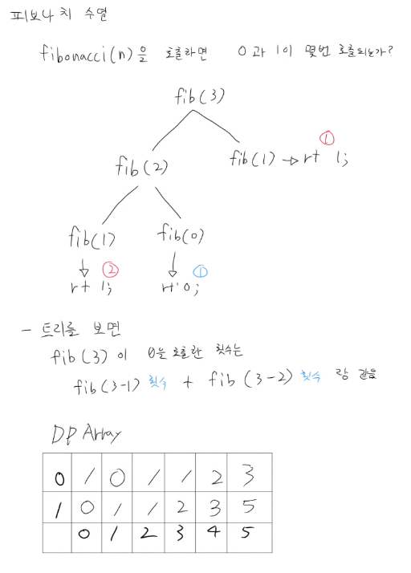

# 피보나치 수열

## 문제
- fibonacci(n)을 하면 fib(0)과 fib(1)이 몇번 호출되는가 계산하는 문제

# 해결

- N은 최대 40인데 재귀로 횟수를 세버리면 O(2$^N$)까지 늘어남
- DP로 해결해야했음

- 그림과 같이 fib(3)이 호출한 횟수 = fib(3-1)이 호출한 횟수 + fib(3-2)이 호출한 횟수 점화식을 찾음
- 그래서 0일때 0은 1번 호출, 1은 0번 호출
- 1일때 0은 0번 호출, 1은 1번 호출 된다는 dp 테이블에 미리 메모이제이션 한다음
- 2부터 메모이제이션을 하기 시작해서 dp[0][i] = dp[0][i-1] + dp[0][i-2] 식으로 값을 채워나감
- 1일때의 경우도 똑같이 적용함
- 2$^N$일 경우 = 1,099,511,627,776번의 연산을 하게됨
- 재귀 호출 자체도 N=40 깊이면 스택 크기상 문제없지만 호출 횟수가 엄청 많기 때문에 시간초과의 직접적인 원인임
- dp의 경우 = O(N)만에 해결 -> 40번의 연산 값을 메모에제이션을 하고 O(1)로 바로 꺼내쓸 수 있었음