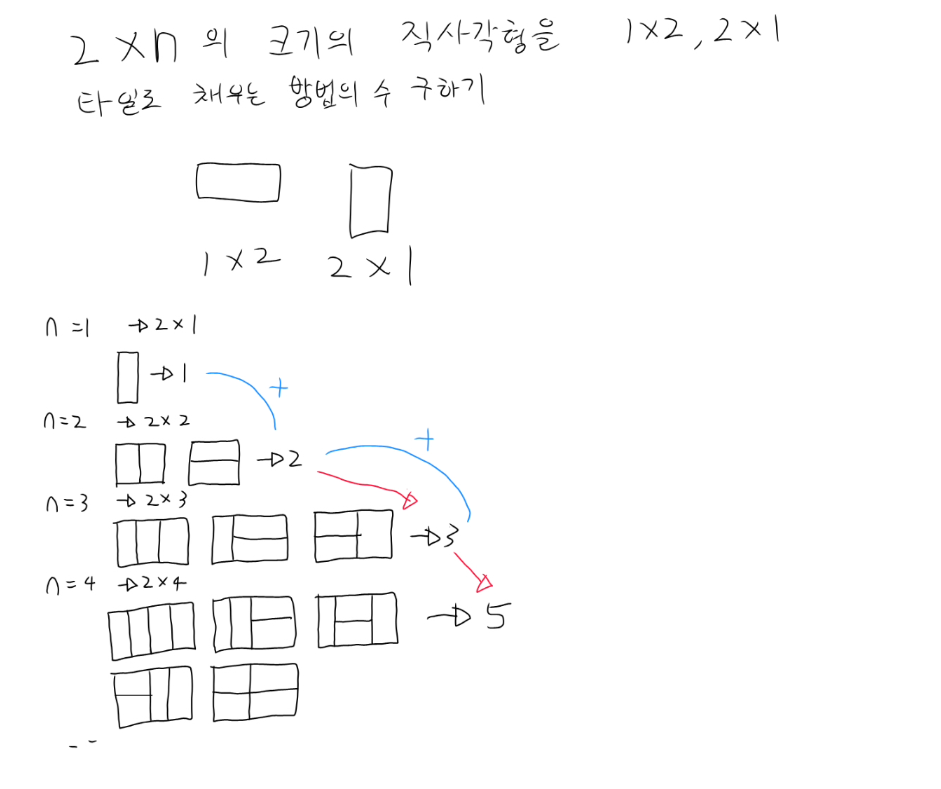

## 백준 11726 (2×n 타일링)

### 문제
- 2×n 직사각형을 1×2, 2×1 타일로 채우는 방법의 수 (mod 10007)

### 해결
- n=1 → 1가지, n=2 → 2가지
- 점화식: `dp[n] = dp[n-1] + dp[n-2]`
- 피보나치 수열과 동일한 구조
- O(N)으로 해결

### 핵심 포인트
- n번째 칸을 세로 타일 1개로 채우면 → 나머지 dp[n-1]
- n번째 칸을 가로 타일 2개로 채우면 → 나머지 dp[n-2]
- 모듈러 연산은 마지막이 아닌 dp 채울 때마다 적용해야 int 범위 초과 방지
- n=1 입력 시 dp[2] 접근으로 ArrayIndexOutOfBoundsException 발생 주의