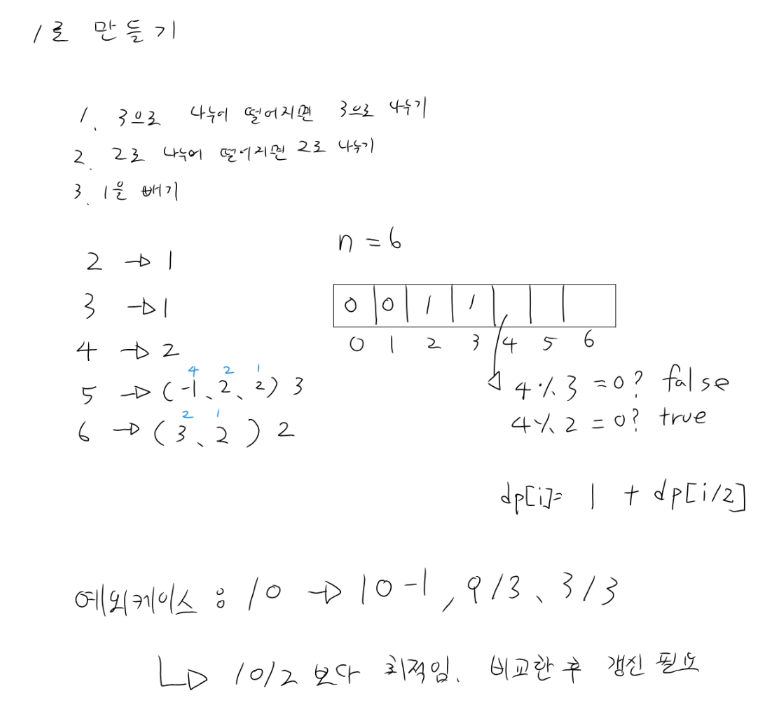

## 백준 1463 (1로 만들기)

### 문제
- 3으로 나누기 / 2로 나누기 / 1 빼기 연산으로 N을 1로 만드는 최소 횟수

### 해결
- 점화식:
    - `dp[i] = Math.min(dp[i], 1 + dp[i/3])` (3으로 나눠질 때)
    - `dp[i] = Math.min(dp[i], 1 + dp[i/2])` (2로 나눠질 때)
    - `dp[i] = Math.min(dp[i], 1 + dp[i-1])` (항상)
- O(N)으로 해결

### 핵심 포인트
- 그리디의 함정: "2로 나눠지면 무조건 나누는 게 이득"처럼 보이지만 틀림
    - 10 → 그리디: 10/2=5, 5-1=4, 4/2=2, 2/2=1 (4번)
    - 10 → 최적: 10-1=9, 9/3=3, 3/3=1 (3번)
- 현재 시점에서 뭐가 최선인지 알 수 없기 때문에 세 가지 경우를 모두 비교해야 함
- 이 문제가 그리디가 아닌 DP로 풀어야 하는 이유