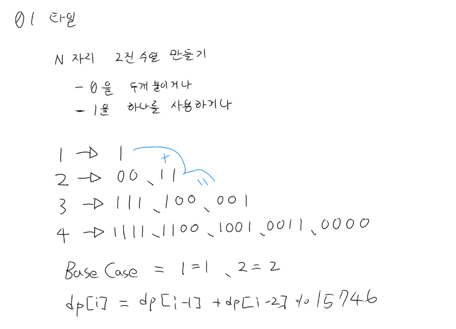

## 백준 1904 (01타일)

### 문제
- 00타일(2칸)과 1타일(1칸)로 N자리 이진 수열 만드는 경우의 수 (mod 15746)

- 
### 해결
- 점화식: `dp[i] = dp[i-1] + dp[i-2]` (피보나치 구조)
- base case: dp[1]=1, dp[2]=2
- O(N)으로 해결

### 핵심 포인트
- 모듈러 연산은 마지막이 아닌 dp 채울 때마다 적용
    - N=1,000,000까지 더하면 long 범위(약 922경)도 초과
    - `dp[i] = (dp[i-1] + dp[i-2]) % 15746`
- 탑다운으로도 구현해봤으나 N=1,000,000이면 재귀 깊이 100만 → 스택오버플로우 위험
- 탑다운 vs 바텀업 선택 기준
    - N 작거나 필요한 값만 듬성듬성 구할 때 → 탑다운
    - N 크거나 전체 테이블 다 채워야 할 때 → 바텀업