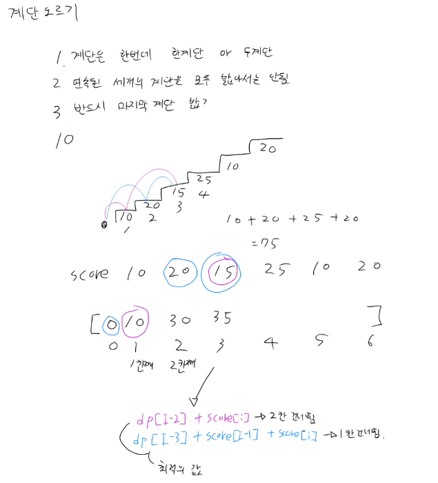

## 백준 2579 (계단 오르기)

### 문제
- 연속 세 계단 금지 조건 하에 계단 점수 합산 최댓값 출력
- 마지막 계단은 반드시 밟아야 함

### 해결
- 점화식: `dp[i] = Math.max(dp[i-2], dp[i-3] + score[i-1]) + score[i]`
- O(N)으로 해결

### 점화식 의미
- `dp[i-2] + score[i]` → i-1 건너뛰고 i 밟기
- `dp[i-3] + score[i-1] + score[i]` → i-3에서 i-1 밟고 i 밟기
- 연속 세 계단 금지 조건을 두 가지 케이스로 분리해서 최댓값 선택

### 핵심 포인트
- n=2 엣지케이스: score[1] + score[2] (둘 다 밟아도 연속 세 계단 조건 안 걸림)
- 1463(1로 만들기)과 동일하게 최솟값/최댓값 선택 DP 패턴
- 상태 정의가 "어디서 왔느냐"에 따라 달라지는 게 이 문제의 핵심