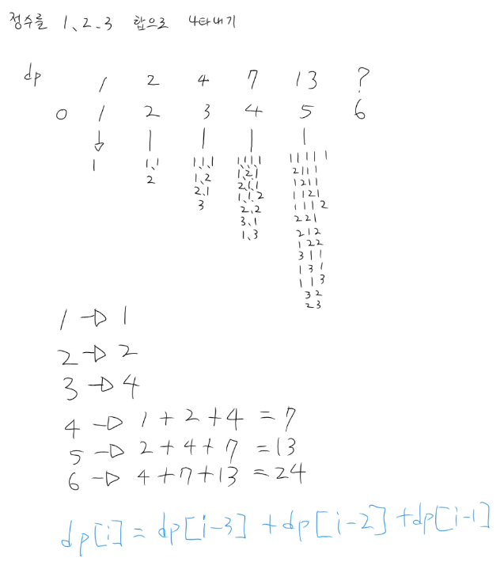

## 백준 9095 (1, 2, 3 더하기)

### 문제
- 정수 n을 1, 2, 3의 합으로 나타내는 방법의 수 출력

### 해결
- 점화식: `dp[i] = dp[i-1] + dp[i-2] + dp[i-3]`
- base case: dp[1]=1, dp[2]=2, dp[3]=4
- 미리 dp[1]~dp[11] 전부 채워두고 T번 O(1) 조회
- O(N) + O(1) * T 로 해결

### 핵심 포인트
- n에 도달하는 마지막 수가 1이면 → dp[n-1]가지
- n에 도달하는 마지막 수가 2이면 → dp[n-2]가지
- n에 도달하는 마지막 수가 3이면 → dp[n-3]가지
- 세 경우를 합산 → 점화식 자연스럽게 유도됨
- 피보나치(1003)에서 했던 "미리 계산 후 조회" 패턴 동일하게 적용