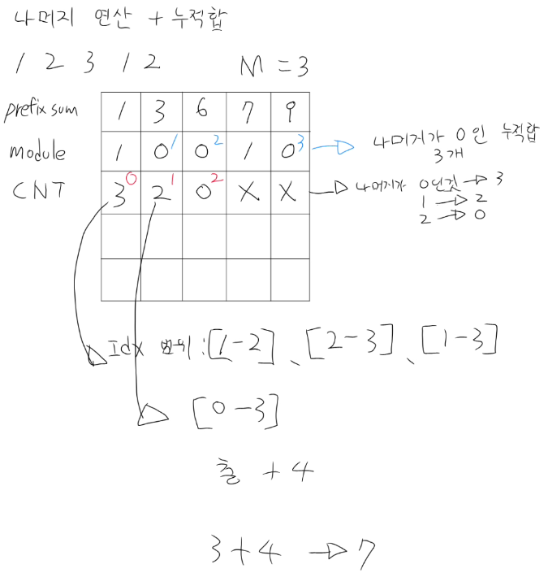

# 백준 10986 - 나머지 합
## 문제
- 수의 개수N (1 <= N <=10$^6$), 나누어 떨어져야 하는수 M (2 <= M <= 10$^3$)
- 출력 연속된 부분 구간의 합이 M으로 나누어떨어지는 구간의 갯수를 출력

## 입력
```text
5 3
1 2 3 1 2
```

## 출력
```text
7
```

## 풀이 및 시간 복잡도 분석


- 먼저 누적합 배열을 만들고 누적합을 기록함
- M으로 나눴을 때 나머지가 몇인지 나머지 누적합을 기록함
- idx로 나머지값을 기록할 cnt배열을 만들고 갯수를 기록함
- nC2 대신 직관적으로 합을 더하는 방식으로 풀이함
  - 0이 3개면
    - (이미 0인 갯수를 세는곳에서 더함) 3 + 2 + 1 을 더함
  - 1이 2개면
    - (2) + 1 을 더함

### 시간 복잡도
- 누적합 배열 만들기
  - O(N) = 1,000,000
- 나머지 누적합 구하기
  - O(N) = 1,000,000
- 단독으로 나머지 0인 것 구하기
  - O(N) = 1,000,000
- 나머지 갯수 세기
  - O(N) = 1,000,000
- nC2 대신 갯수로 값 더학히
  - 최악의 경우에도 최대 1,000,000임, (안쪽 연산 누적 총합이 N에 수렴함)
- 총 시간 복잡도 5,000,000
- O(4$^N$)으로 마무리함


### 포인트 더하기
- 최적화 코드
```java
import java.io.BufferedReader;
import java.io.IOException;
import java.io.InputStreamReader;
import java.io.StringWriter;
import java.util.StringTokenizer;

public class Main {
    public static void main(String[] args) throws IOException {
        BufferedReader br = new BufferedReader(new InputStreamReader(System.in));
        StringTokenizer st = new StringTokenizer(br.readLine());

        int N = Integer.parseInt(st.nextToken());
        int M = Integer.parseInt(st.nextToken());

        // 1. 나머지의 빈도수를 저장할 카운팅 배열
        // 나머지는 0부터 M-1까지 종류가 존재함
        long[] cnt = new long[M]; 
        
        long sum = 0;
        long result = 0;

        st = new StringTokenizer(br.readLine());
        for (int i = 0; i < N; i++) {
            // 입력을 받으면서 실시간으로 누적합 계산
            long current = Long.parseLong(st.nextToken());
            sum += current;
            
            // 2. 누적합의 나머지 구하기
            int remainder = (int) (sum % M);
            
            // 3. 만약 1번 인덱스부터 현재까지의 누적합 자체가 이미 M으로 나누어 떨어진다면?
            if (remainder == 0) {
                result++;
            }
            
            // 4. 해당 나머지 인덱스의 빈도수 칩을 하나 쌓아 올림
            cnt[remainder]++;
        }

        // 5. 빈도수 배열을 돌면서 같은 나머지를 가진 지점들 중 2개를 고르는 조합(nC2) 계산
        // 수식: n * (n - 1) / 2
        for (int i = 0; i < M; i++) {
            if (cnt[i] > 1) { // 2개 이상 쌓여있어야 짝을 지을 수 있음
                result += (cnt[i] * (cnt[i] - 1)) / 2;
            }
        }

        // 최종 정답 출력
        System.out.println(result);
    }
}
```

- 최적화 코드 방식은 for문 안에서 누적합, 나머지 연산, cnt를 동시에해서 O(N)
- 나는 복잡하고 직관적이지 않은 수학 공식을 쓰지 않고 싶었음
- 그래서 cnt가 4면 3 + 2 + 1을 더하는 j 루프를 돌리는 규칙을 만듬
- 내 코드와 최적화 코드를 풀어 해치면 400만 줄과 200만 줄이라는 2배정도 차이나는 성능이 있음
- 뭔가 유지보수 하기 쉽게 짜고싶었고 내가 의도한대로 도전해봤음
- 메모리 적으로도 배열을 많이 사용하고 연산도 적지않기 때문에 다시 생각해보면 코테라는 틀 안에서 이성적으로 생각해보면 유지보수와 최적화 관점에서 트레이드 오프를 생각해보면 역시 O(N)이 더 좋은것이라 생각함
