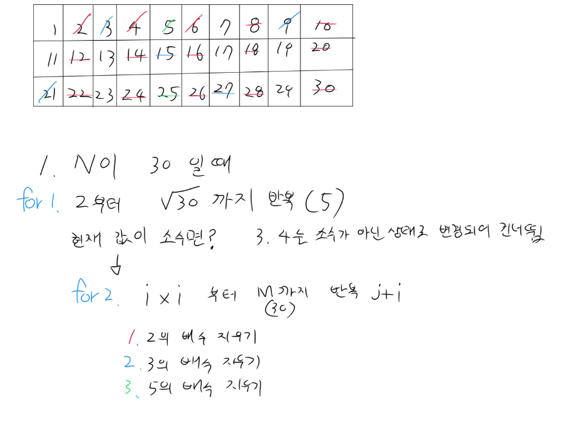

### M이 30이라면 왜 7의 배수는 안지워도 될까?
- √30 = 5.4 니까 i를 5까지만 돌림
- 핵심은 7의 배수는 이미 더 작은 소수의 배수로 전부 지워짐
- √N 이하의 소수로 닫 처리되는 이유는 N 이하의 합성수는 반드시 √N 이하의 소인수를 하나 가짐

### 시간 복잡도
- 소수 판별을 단순하게 하면 O(N$^2$)
- 에라토스테네스의 체는 O(N log log N)
- 사실상 모든 소수를 걸러내는데까지 도달하려면 O(N)에 가까움

### i*i 부터 시작하는 이유
- i보다 작은 배수들은 이미 이전 소수에서 지워졌기 때문
- ex) i=5일 때 5*2, 5*3, 5*4는 각각 2, 3, 2의 배수로 이미 처리됨