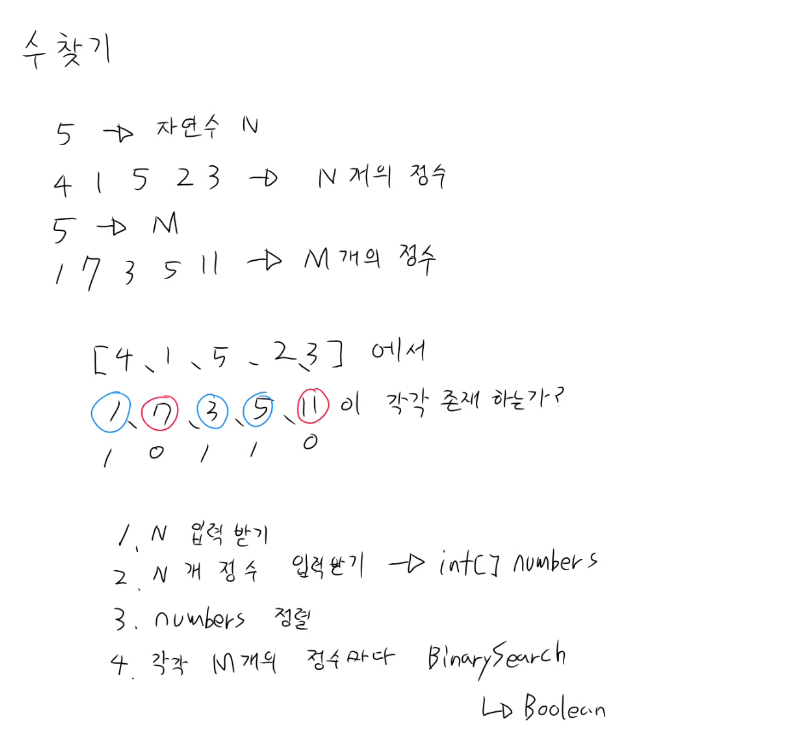

# Day 1 (4주차) - 이분탐색 / 01타일

## 백준 1920 (수 찾기)

### 문제
- N개의 정수 배열에서 M개의 수가 존재하는지 각각 1/0으로 출력



### 해결
- Arrays.sort()로 정렬 후 이분탐색으로 존재 여부 확인
- O(N log N) 정렬 + O(M log N) 탐색

### 구현
```java
static boolean BinarySearch(int target, int left, int right) {
    if (left > right) return false;
    int mid = (left + right) / 2;
    if (numbers[mid] == target) return true;
    if (numbers[mid] < target) return BinarySearch(target, mid + 1, right);
    else return BinarySearch(target, left, mid - 1);
}
```

### 핵심 포인트
- 이분탐색은 반드시 정렬된 배열에서만 동작
- base case: `left > right` (left >= right 로 하면 마지막 원소 못 찾는 버그)
- 재귀 깊이 최대 log2(100,000) ≈ 17번 → 스택오버플로우 걱정 없음
- 이분탐색은 재귀보다 while 반복문으로 짜는 게 더 일반적
- 재귀 함수 구현과 dp 탑 다운 구현을 병행으로 하다보니 재귀 구현이 익숙해짐을 느낌
