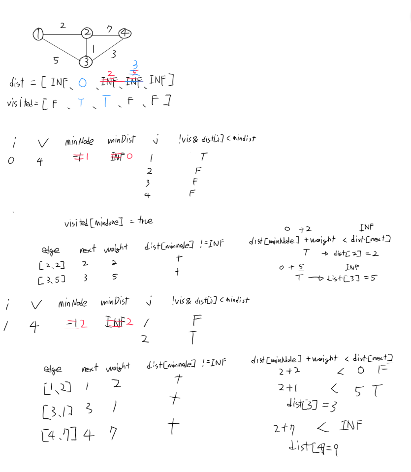

### 백준 1753 - 최단경로

### 문제
방향그래프에서 시작 정점 K로부터 다른 모든 정점까지의 최단 경로를 구하는 문제.
간선 가중치는 10 이하의 자연수, 동일 정점 쌍 사이에 여러 간선이 존재할 수 있음.
도달 불가능한 정점은 INF 출력. 전형적인 다익스트라 문제.

### 접근
- 우선순위 큐(최소 힙) 기반 다익스트라 구현
- dist[]를 INF로 초기화 후 시작점만 0 PQ에 [시작점, 0] 으로 삽입
- PQ에서 거리 오름차순으로 꺼내며 d > dist[node]면 낡은 정보이므로 스킵
  - PQ에서 꺼낸 d가 dist[node]보다 크다는 건, dist[node]가 이미 그보다 더 작은 값으로 갱신된 이후임 -> 즉 d는 예전에 넣었던 낡은 정보
- 스킵되지 않은 정점만 dist[node] + weight < dist[next]며녀 갱신 후 pq에 재 삽입

### 헷갈렸던 지점

1. O($V^2$) 배열 버전 -> PQ 버전으로 넘어가는 과정 자체가 크게 헷갈림
- 처음엔 다익스트라 자체가 BFS나 DFS보다 어렵게 느껴져서 그래프를 손으로 직접 그려가며 inNode, MinDist,visited 테이블이 있는 버전부터 단계 별로 따라감

- 이후 같은 그래프로 PQ 버전을  단계식 다시 따라가면서 정확히 같은 결과를 내는지 비교함

2. PQ 버전에서 if(d > dist[node]) continue;가 왜 필요한지, 항상 최적값을 보장하는지 헷갈림
- PQ 버전은 visisted[] 없이 같은 정점이 여러번 큐에 들어갈 수 있음
- dist 값은 갱신될 때 항상 감소만 하므로, 먼저 처리된 값이 진짜 최단거리로 확정되고, 이후 큐에서 꺼내지는 낡은 값은 d > dist[node] 체크로 걸러짐
- 즉 continue 처리 되는 순간이 O($V^2$) 버전의 visitied[node] = true 가 되는 시점과 논리적으로 동일하다는 것을 깨달음

3. O($V2$) -> PQ 최적화의 정확한 의미
- 최솟값 찾기가 O(V) -> O($log$ $V$)로 줄어든 것임
- 연산이 정젖ㅁ 수가 아니라 reaxation 발생횟수만큼 반복 될 수 있어서 전체 시간복잡도가 O( (V+E) log V)가 된다는 것을 깨달음

### 회고
- 다익스트라는 BFS/DFS보다 확실히 난이도가 높다는걸 체감함
- 코드만 보고 이해하려다 막혀서 그래프를 손에 그려가며 단계별로 따라간게 효과적이었음
- 특히 PQ버전에서 같은 정점이 여러 번 큐에 들어갈 수 있다는 부분, 먼저 처리되는 것이 최적값이고 나머지는 낡은 정보로 걸러짐
  - 논리를 직접 예제로 추적해보고 나서야 이해했음
- 단ㅅ눈히 암기가 아니라 왜 이 최적화가 성립하는가를 이해하려 한게 오늘 가장 크게 남았던 부분임