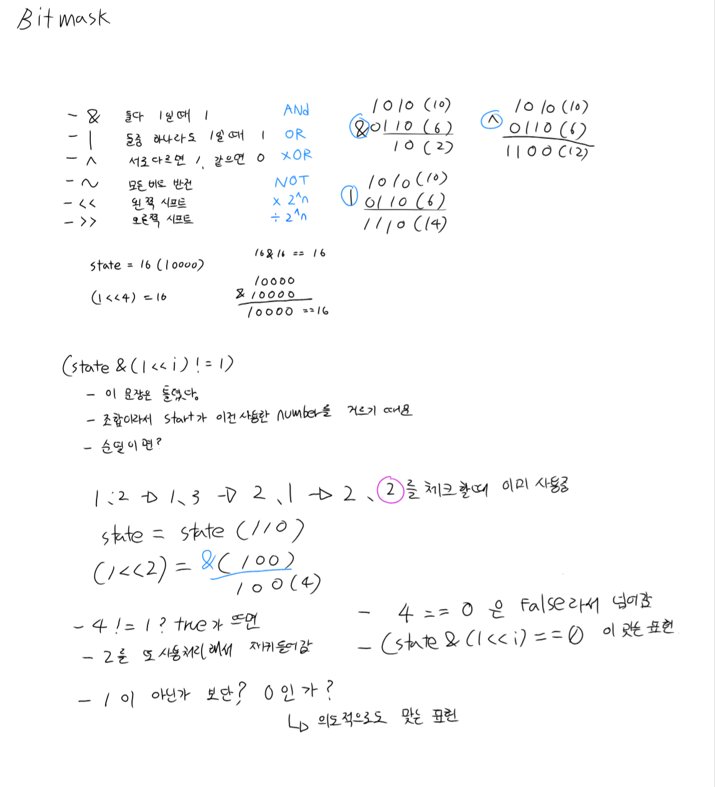

## 비트마스크 기초 + 백준 15650 재구현

### 주제
배열(boolean[] used) 대신 정수 하나(int state)로 여러 개의 on/off 상태를 표현하는
비트마스크 기법을 학습하고, 이미 풀었던 15650(N과 M(2))을 used 배열 대신 비트마스크로
다시 구현.

### 접근
- 비트 켜기: `state = state | (1 << i)`
- 비트 확인: `(state & (1 << i)) != 0` (켜짐) / `== 0` (꺼짐)
- 비트 끄기: `state = state & ~(1 << i)`
- `int`는 32비트라 N≤32 범위의 문제에 비트마스크 적용 가능. byte(8비트)와 헷갈리지 않도록
  자료형별 비트 수 차이를 짚고 감
- 비트마스크의 이점: boolean 배열 대비 공간을 아끼는 것뿐 아니라, 상태 하나를 정수 값
  하나로 취급할 수 있어 저장/비교/전달이 단순해짐 (Map의 key로 바로 쓸 수 있는 것 등)
- 15650을 `used[]` 대신 `int state`로 바꿔 조합 백트래킹 재구현

### 헷갈렸던 지점 (핵심)
- **`(state & (1 << i)) != 1` 조건의 오류**: "i번째 비트가 켜져 있는가"를 확인하려는 의도로
  썼으나, `state & (1<<i))`의 결과값은 i가 커질수록 1이 아니라 2, 4, 8, 16 등으로 커짐
  (그 자리의 실제 크기, 2^i). 따라서 `!= 1` / `== 1`로 비교하는 것은 i=0일 때만 우연히
  맞고 그 외에는 항상 잘못된 판정이 됨. 올바른 판단 기준은 결과가 "0이냐 아니냐"뿐임
  (`== 0`: 꺼짐, `!= 0`: 켜짐), 또는 `((state >> i) & 1) == 1`처럼 비트를 실제로
  옮겨서 비교하는 방법
- **왜 이 버그가 15650(조합)에서는 드러나지 않았는지**: 조합 백트래킹은
  `for (int i = start; ...)` + `backtracking(depth+1, i+1)` 구조라 매 반복문에서
  "이미 켜진 비트"를 다시 마주치는 상황 자체가 생기지 않음. 따라서 이 구간에서
  `state & (1<<i)`는 항상 0이 나오고, `!= 1`이든 `== 0`이든 결과가 동일(항상 통과)하게
  나와 버그가 있어도 정답이 출력됨
- 실제로 반례를 만들어 확인함: `start` 없이 매번 1부터 다시 훑는 구조(순열처럼)로 바꿔
  `!= 1` 조건을 적용하면 이미 사용한 숫자를 중복으로 선택하는 오류("1 1"처럼 같은 숫자가
  반복 출력됨)가 실제로 발생함을 검증
- `1 << i`의 의미를 재확인: 이는 state와 무관하게 그 자체로 "i번째 자리에만 불이 켜진
  정수값(2^i)"이며, state와 & 연산을 할 때 비로소 "그 자리가 켜져 있는지 걸러내는
  마스크" 역할을 함

## 회고
- 겉으로 정답이 나온다고 해서 조건식이 논리적으로 옳다는 보장은 아니라는 것을 이번 기회에
  제대로 검증함. "왜 이 특정 문제 구조에서는 틀린 조건이 티가 안 나는가"까지 반례를 직접
  만들어 확인한 것이 이번 학습에서 가장 중요한 부분이었음
- 비트 연산에서 "자리(위치)"와 "그 자리가 가지는 정수 값"을 구분하는 것이 핵심이라는 점을
  확실히 정리함 — 10진수의 "백의 자리에 5가 있으면 500"이라는 비유로 이해를 도움
- 다음에 비트마스크를 활용한 DP(외판원 순회 등)로 넘어갈 때, 오늘 다진 기본 연산
  (켜기/확인/끄기)과 이번에 명확히 잡은 "0 기준 판단" 원칙을 그대로 재사용할 수 있음

### 손으로 검증 하기

- AND/OR/XOR 예시 계산(1010 & 0110 = 0010, 1010 | 0110 = 1110, 1010 ^ 0110 = 1100)을
  직접 손으로 계산해 각 연산자의 동작을 재확인
- `state=16(10000)`일 때 `16 & 16 == 16`이라는 것을 자리별 AND로 직접 계산해 검증
  (착각하기 쉬운 "둘 다 1이니까 결과가 1"이라는 오해를 자리별 계산으로 바로잡음)
- 순열 시나리오(1,2 → 1,3 → 2,1 → 2,2를 다시 체크)를 손으로 끝까지 추적해,
  이미 사용한 비트(2)를 재귀 안에서 다시 검사할 때 `state & (1<<2) = 4`가 나오고
  `4 != 1`은 true(잘못 통과), `4 == 0`은 false(정확히 막힘)임을 직접 확인함
- 결론: "1이 아닌가"가 아니라 "0인가"가 의도적으로도 맞는 표현이라는 것을 스스로 정리함